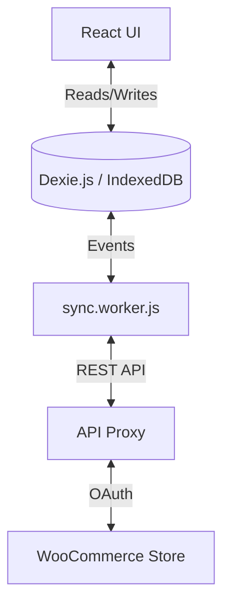

# Sync Engine Documentation

The "Sync Engine" is the core differentiator of this application. It enables a **Local-First** experience where the UI reads from `IndexedDB` (Dexie.js) instantly, while a background Web Worker handles data synchronization.

## Architecture

## 1. The Local Database (`Dexie.js`)
*   **Location:** `apps/web/src/db/db.js`
*   **Versioning:** The DB handles schema migrations (currently v26).
*   **Multi-Tenancy:** All tables (e.g., `orders_v2`) use a compound primary key `[account_id+id]` to allow multiple stores to coexist in the same browser.

## 2. The Web Worker (`sync.worker.js`)
*   **Role:** Runs on a separate thread to prevent UI freezing during heavy data processing (importing 10k orders).
*   **Communication:** Uses `postMessage` to receive commands (`START`, `DOWNLOAD_DB`) and send `PROGRESS` updates.
*   **Logic:**
    1.  **Enrichment:** Adds `account_id` to every item.
    2.  **Pagination:** Automatically handles WooCommerce header-based pagination.
    3.  **Batching:** Uses `bulkPut` (Dexie) for high-performance inserts.

## 3. Delta Sync Strategy
The worker tracks the `last_synced` timestamp for every entity.
*   **First Run:** Fetches ALL data (`forceFull: true`).
*   **Subsequent Runs:** Only fetches items `modified_after` the last successful sync.

## 4. Automation Triggers
The worker also acts as an automation engine.
*   **Order Status Hook:** When syncing Orders, it checks for `order_status_change` automation rules.
*   **Action:** If a rule matches (e.g., "Order -> Completed"), it sends an email via the backend proxy.

## 5. Backend "Engine" (`apps/api/src/sync/engine.ts`)
While the frontend worker syncs *down* data, the backend engine is used for server-side aggregation and "Shadow Syncing" (keeping a server-side copy of data for analytics without relying on client browsers).
*   **Tables:** `sync_state` tracks server-side progress.
*   **Upsert:** Uses `onConflictDoUpdate` to efficiently merge data into PostgreSQL.
